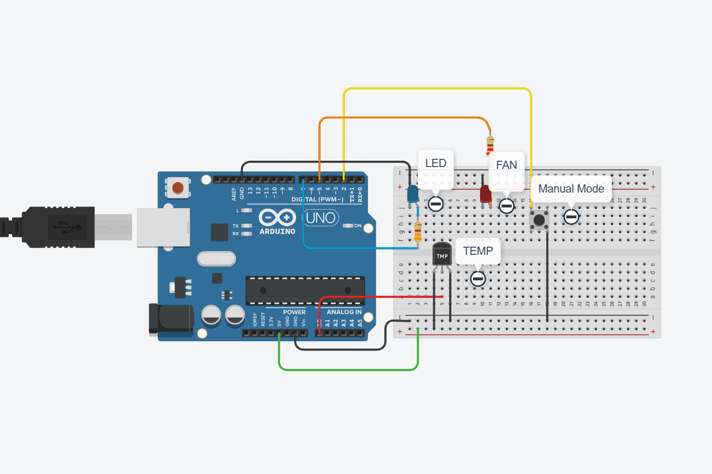

# 🌬️ Smart Fan Control System (Auto + Manual Mode)

A beginner-to-intermediate level Arduino project that **automatically controls fan speed based on temperature**, with an optional **manual override** mode. Ideal for students, hobbyists, and embedded systems portfolios.

---

## 🔥 What It Does

- 🌡️ **Auto Mode:** Fan adjusts speed using temperature sensor (TMP36)
- 🔘 **Manual Mode:** Push button turns fan ON/OFF directly
- 💡 **LED indicator** shows fan status
- 🧠 **Smart logic** with debouncing using `millis()` — no false triggers!

---

## 📸 Circuit Overview

---
---

## 📄 Arduino Code

📂 Click to view the full code here:  
[`SmartFanControl.ino`](./SmartFanControl.ino)

> Contains complete logic for auto/manual fan control using temperature and push button.

## 🔧 Components Used

| Component         | Qty |
|------------------|-----|
| Arduino UNO       | 1   |
| TMP36 Sensor      | 1   |
| Push Button       | 1   |
| LED (fan output)  | 1   |
| 220Ω Resistor     | 2   |
| Breadboard + Wires| ✅  |

📎 Full List: [`bom.csv`](./bom.csv)

---

## ⚙️ How It Works

- On startup → Auto Mode is active
- TMP36 reads temperature → Fan speed adjusts (PWM)
- Button toggles to Manual Mode → LED simulates fan ON/OFF
- Uses `millis()` to debounce button (smooth input detection)

---

---

## 🚀 Why This Is Useful

✅ Learn analog sensor reading  
✅ Practice PWM + LED fan control  
✅ Understand manual vs auto modes  
✅ Build better embedded logic using `millis()`  
✅ Impress in interviews & college demos!

---

## 👨‍💻 Author

**Parth Pawar**  
🔗 [GitHub](https://github.com/parth-558)  
🔗 [LinkedIn](https://www.linkedin.com/in/parth-pawar-b82628248/)

---

## 🔖 Tags

`arduino`, `fan control`, `temperature`, `TMP36`, `PWM`, `iot`, `tinkercad`, `manual override`, `smart system`
